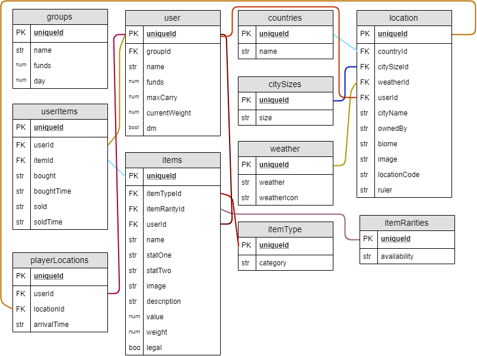

A website designed to create an easy to use economy and shop system for a Star Wars DnD table top game.

<h1>The Smugglers Datapad</h1>

version 0.0.0.0 pre-Alpha Release (current release)

version 0.16.0.0 pre-Alpha Release (pre-release)

# To view current release:
1) Go to https://thesmugglersdatapad.000webhostapp.com

# To view pre-release:
1) Fork a copy of the pre-release code at https://github.com/iamnickmitchell/The-Smugglers-Datapad.
2) Go into the kennel subfolder using the terminal of your choice (I currently use GitBash).
3) Start a localhost server and run npm start (you must have node.js installed).

# To use the app (current release):

# To use the app (pre-release):

# Built using:
Programming Languages:
----------------
* HTML5
* CSS3
* Javascript

Frameworks:
----------------
* react.js
* redux

Modules:
----------------
* moment.js - timestamps
* react-router - route components
* react-router-dom - route components
* bootstrap - styling
* materializeui - styling

Styling Libraries:
----------------
* fontawesome - icon fonts
* bootstrap - style presets
* google fonts - text fonts
* materializeui - card presets

Software Programs:
----------------
* Microsoft Visual Code - coding terminal
* GitBash/ GitHub - terminal
* Heroku - API storage

# ERD:

# Authors:
<h3>Nick Mitchell - lead designer, lead coder<h3>

# Licensing:
This project is licensed under the MIT License - see the LICENSE.md file for details

# Acknowledgments:
* NewForce - for teaching me how to code (I think this is a pretty important part)
* Friends - for giving me a reason to make this
* Family - for supporting me with feedback as features are added
* My Wonderful Fiance Megan - for being the one to carry the burden of listening to me rambling about code, cheering me up when I'm frustrated with code not working, and keeping me on track to reach my lofty goals and deadlines.

-----------
-- Ayrshire Technologies 2019 --

Latest update: 3/27/2019